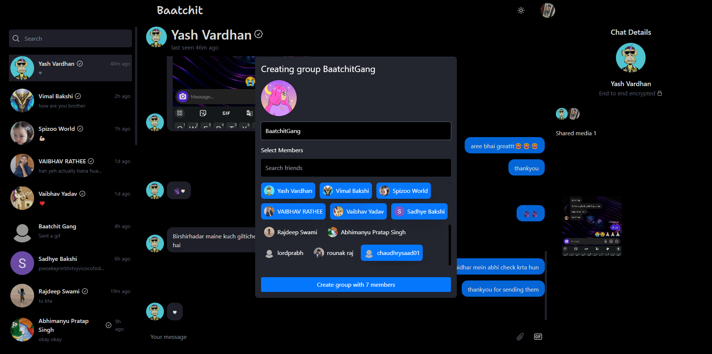
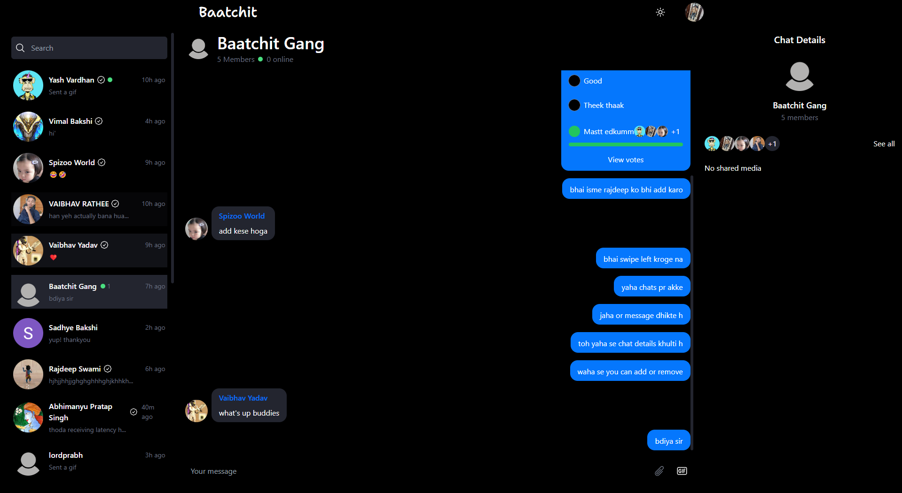

# Baatchit 🗨️

Baatchit is a modern real-time chat application designed to facilitate seamless communication between users. With Baatchit, users can engage in conversations, share files, see when others are typing, and more, all in real-time.




## Features ✨

- **🔒 End-to-End Encryption**: Ensure your private chats are secure with advanced encryption, protecting your messages from unauthorized access.
- **🔑 Private Key Recovery**: Recover your private encryption key securely through a password-protected and MFA email verification process, ensuring you never lose access to your encrypted messages.
- **📲 Push Notifications**: Stay updated with instant push notifications, ensuring you never miss a message even when the app is closed.
- **💬 Real-time Messaging**: Instantly send and receive messages with other users.
- **🤝 Friends Feature**: Connect with other users and engage in private chats or group conversations after adding them as friends.
- **👥 Group Chats**: Create and participate in group chats with multiple users.
- **🟢 User Presence**: See who's online and available for chat in real-time.
- **⌨️ Typing Indicators**: See when other users are typing to enhance communication flow.
- **✔️ Message Seen Status**: Know when your messages have been seen by other users.
- **✏️ Edit Messages**: Edit your messages in real-time, with updates reflected instantly for all users and an indication that the message has been edited.
- **😀 Message Reactions**: React to messages with emojis to express your feelings and engage more interactively, including double-tap to like or unlike a message.
- **🗑️ Delete Message**: Delete messages after sending them ensuring full control over your conversation
- **📁 File Sharing**: Share files and documents securely within chats.
- **🎉 GIF Sending**: Express yourself with animated GIFs using the integrated Tenor GIF library.
- **📊 Polling**: Send polls with either multiple votes set to true or false, allowing users to gather opinions and feedback.
- **🔒 OAuth Integration**: Sign in easily using social login options like GitHub and Google.
- **📱 Progressive Web App (PWA)**: Install the app on your phone or desktop and enjoy a native app-like experience.

## Technologies Used 🛠️

### Frontend Technologies Used:
- **⚛️ React**: A JavaScript library for building user interfaces.
- **🔗 React Router Dom**: Declarative routing for React applications.
- **🛠️ Redux Toolkit**: An opinionated, batteries-included toolset for efficient Redux development.
- **🔄 Socket.IO Client**: Real-time bidirectional event-based communication library for web applications.
- **📑 React Hook Form**: Performant, flexible, and extensible forms with easy-to-use validation.
- **📝 Zod**: A TypeScript-first schema declaration and validation library.
- **🎥 Framer Motion**: A production-ready motion library for React.
- **🎬 Lottie React**: Render After Effects animations on React-based web apps.
- **🖼️ Gif Picker React**: Provides a simple and easy-to-use UI for selecting GIFs.
- **🔔 React Hot Toast**: Toast notifications for React applications.
- **💅 Tailwind CSS**: A utility-first CSS framework for rapid UI development.
- **🔥 Firebase**: A platform developed by Google for creating mobile and web applications, used in this project for push notifications only.
- **🧠 Lodash**: A JavaScript library which provides utility functions for common programming tasks.
- **📅 Date-fns**: Modern JavaScript date utility library.
- **🛡️ React Helmet Async**: Handle changes to the document head in a React application.
- **🦺 TypeScript**: A typed superset of JavaScript that compiles to plain JavaScript.
- **⚡ Vite**: A build tool that aims to provide a faster and leaner development experience for modern web projects.
- **🔌 Vite Plugin PWA**: Plugin for adding PWA capabilities to Vite applications.

### Backend Technologies Used:
- **🟢 Node.js**: A JavaScript runtime built on Chrome's V8 JavaScript engine.
- **🌐 Express**: Fast, unopinionated, minimalist web framework for Node.js.
- **🔄 Socket.IO**: Real-time bidirectional event-based communication library for Node.js.
- **📂 MongoDB (with Mongoose)**: A NoSQL database for storing application data.
- **🔒 Bcryptjs**: Library for hashing passwords.
- **☁️ Cloudinary**: Cloud-based image and video management service.
- **🔓 Cors**: Middleware for handling Cross-Origin Resource Sharing (CORS).
- **🔧 Dotenv**: Module to load environment variables from a `.env` file.
- **🛡️ Helmet**: Middleware to secure Express apps by setting various HTTP headers.
- **🔐 Jsonwebtoken**: Library to create and verify JSON Web Tokens (JWTs).
- **📈 Morgan**: HTTP request logger middleware for Node.js.
- **📤 Multer**: Middleware for handling `multipart/form-data`, primarily used for file uploads.
- **📧 Nodemailer**: Module for sending emails from Node.js applications.
- **🔑 Passport**: Authentication middleware for Node.js.
- **🔍 Passport-Google-Oauth20**: Passport strategy for authenticating with Google using OAuth 2.0.
- **🔢 UUID**: Library for generating universally unique identifiers (UUIDs).
- **🍪 Cookie**: Simple cookie parsing and serialization.
- **🍪 Cookie-Parser**: Parse Cookie header and populate `req.cookies` with an object keyed by cookie names.
- **🔥 Firebase Admin**: Firebase Admin SDK for access to Firebase services.
- **🧩 Zod**: TypeScript-first schema declaration and validation library.
- **🛠️ Typescript**: A typed superset of JavaScript that compiles to plain JavaScript.
- **🔧 Concurrently**: Run multiple commands concurrently.
- **🔧 Cross-Env**: Run scripts that set and use environment variables across platforms.
- **♻️ Nodemon**: Automatically restart Node.js applications on code changes.
- **🛠️ Pre-Commit**: Pre-commit hook runner.
- **🚮 Rimraf**: A deep deletion module for Node.js.


### Getting Started 🚀

To get started with Baatchit, follow these steps:

1. Clone the repository: `git clone https://github.com/RishiBakshii/Baatchit`
2. Navigate to the project directory: `cd Baatchit`

### Setting Up Environment Variables 🌐

Before starting the application, ensure you set up the necessary environment variables. Both the frontend and backend have a `.env.example` file provided. Follow these steps:

1. **Copy the provided `.env.example` file**: Use this file to create your own `.env` file in both the frontend and backend directories.
   
2. **Update `.env` with your credentials**: Open the `.env` file in each directory (`frontend` and `backend`) and replace the placeholder values with your actual credentials and secrets. This includes API keys, database URLs, and any other sensitive information required by the application.

3. **Set up Firebase Admin credentials**:
   - In the `backend/src` directory, create a file named `firebase-admin-cred.json`.
   - Place your Firebase service account credentials in this file. Ensure the path to this file matches the `GOOGLE_APPLICATION_CREDENTIALS` environment variable in your `.env` file. For example:
     ```
     GOOGLE_APPLICATION_CREDENTIALS=src/firebase-admin-cred.json
     ```
   - If you choose a different name or path for the credentials file, make sure the `GOOGLE_APPLICATION_CREDENTIALS` variable reflects this.

4. **Save and verify**: Save the `.env` files once you have updated them with your details. Verify that all necessary variables are correctly set to ensure the application functions as intended.

5. **Important**: Do not commit your `.env` files to version control systems like Git (ensure they are listed in your `.gitignore` files).

### Installing Dependencies and Starting the Application 🛠️

Now that you have set up your environment variables, proceed with the following steps to install dependencies and start the frontend and backend servers:

1. **Frontend**:
   - Open a terminal and navigate to the `frontend` directory: `cd frontend`
   - Install dependencies: `npm install`
   - Start the frontend development server: `npm run dev`
   - Visit `http://localhost:5173` in your browser to access the frontend application.

2. **Backend**:
   - Open another terminal (or split your terminal window if supported) and navigate to the `backend` directory: `cd ../backend`
   - Install dependencies: `npm install`
   - Start the backend server: `npm run dev`
   - Ensure the backend server is running correctly to support the frontend functionalities.

### Tip: Using Split Terminals

To manage frontend and backend servers simultaneously:

- **VS Code**: Right-click on the terminal and choose "Split Terminal." Navigate to the frontend and backend directories in separate terminals for easy monitoring.


### Running the Application with Docker 🐳

You can also use Docker to containerize and run Baatchit. Follow these steps to set up and run the application using Docker:

1. **Build and Start Containers**:
   - Ensure you have Docker and Docker Compose installed on your machine.
   - Open a terminal and navigate to the project directory: `cd Baatchit`
   - Build and start the containers: `docker-compose up --build`

2. **Access the Application**:
   - The frontend will be available at `http://localhost:5173`
   - The backend will be available at `http://localhost:8000`
   - MongoDB will be available at `mongodb://localhost:27017`

3. **Stopping the Containers**:
   - To stop the containers, press `Ctrl+C` in the terminal where `docker-compose` is running.
   - Alternatively, you can run: `docker-compose down` to stop and remove the containers.


## Contributing 🤝

Contributions are welcome! If you'd like to contribute to Baatchit, please follow these steps:

1. Fork the repository.
2. Create a new branch: `git checkout -b feature-name`
3. Make your changes and commit them: `git commit -am 'Add new feature'`
4. Push to the branch: `git push origin feature-name`
5. Submit a pull request.

## Contact 📧

For any inquiries or feedback, please contact me at [rishibakshiofficial@gmail.com](mailto:rishibakshiofficial@gmail.com).